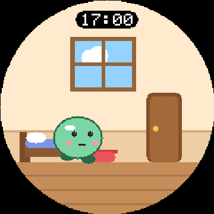
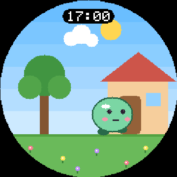

# Desk Pet (Tomodachi) — proof of concept

A Tamagotchi-style pet for a 240×240 round ESP32 touch screen. It lives in a
house, walks out to the yard, eats, plays and sleeps on its own. It also
reminds you of meetings and reacts to phone notifications. Creatures, scenes
and sounds come from **content packs** that you can swap without reflashing.

This repo implements **roadmap stage 1 (MVP without hardware)**, built so the
same engine code flashes to the RM49 DIYMORE ESP32-C3 board unchanged.

| | |
|---|---|
|  |  |

## Quick start (PC)

```bash
sudo apt install cmake g++ libsdl2-dev        # macOS: brew install cmake sdl2
cmake -S . -B build && cmake --build build -j
./build/deskpet_tests                         # 30 unit tests
./build/deskpet_headless                      # MVP gate scenario + screenshots in shots/
./build/deskpet_sim                           # the pet in a window (run from repo root)
```

Simulator controls: the mouse is your finger (click, double click, hold,
drag to swipe). Keyboard shortcuts:

| Key | Action | Key | Action |
|---|---|---|---|
| arrows | swipe | `n` | fake phone notification |
| space | tap | `m` | meeting in 10 min |
| enter | double tap | `f` | pet time ×1 / ×60 / ×600 |
| `l` | long press | `1` | zoom (1 = real panel size) |
| esc / backspace | BOOT (back) | `p` | screenshot |

Mock meetings come from `mock/calendar.json`. It uses the same shape the
Apps Script returns, and the simulator re-reads it every minute.

## Quick start (board)

See [docs/HARDWARE.md](docs/HARDWARE.md). In short:

```bash
pip install platformio
pio run -e esp32c3 -t upload      # firmware
pio run -e esp32c3 -t uploadfs    # packs + secrets from fs/
pio device monitor                # serial console, type "help"
```

## Layout

```
engine/            portable C++17 engine (no Arduino/SDL includes). Also a PlatformIO library.
  include/deskpet/   hal.h = the only door to hardware
platform/pc/       PC HAL + headless gate runner
platform/sim/      SDL2 simulator
platform/esp32/    ESP32-C3 HAL: LovyanGFX GC9A01 + CST816, LittleFS, Wi-Fi, BLE
fs/                LittleFS image: packs/ (and your untracked secrets.json)
tools/             png2dps.py (PNG -> sprite format), sample pack generator
integrations/      Google Apps Script calendar feed, secrets example
tests/             unit tests (pet rules, alerts, gestures, untrusted pack parsing)
docs/              architecture & migration, pack format, hardware bring-up
```

## What works

- **Pet**: food/fun/energy/XP with decay rates and actions from the spec.
  Mood table (first match wins) and the level formula are also from the spec.
  Stats under 30 show amber.
- **World**: house (bed, bowl, window, door) and yard (tree, house front,
  flowers). Named spots; goals for Sleep, Feed, Walk and Play. The pet goes
  home first when it is outside. Idle wandering, blinking and look direction.
  A happy pet goes out on its own and comes back when tired, bored or after
  45 ticks. Tap gives a jump and a heart. 280 ms ticks with a two-frame walk.
- **Screens**: Home, Stats (swipe ←), Agenda (→), Actions (↑), Settings (↓),
  Upload. BOOT always goes back. Meeting and notification overlays follow
  the priority rules (meetings bypass DND and wake the pet; notifications
  are muted by DND, queued while asleep and held behind meetings).
- **Packs**: `manifest.json` covers stats, decay, mood thresholds, rules,
  evolution, scenes and spots, and RTTTL sounds. Optional 4-bit sprite sheets
  and scene backgrounds. Every field is validated and bounded; a bad pack
  falls back to the built-in default. Three packs ship: procedural **Blobby**,
  and sprite-based **Sprout** and **Wisp**. `tools/image2pack.py` turns any
  single picture into a pack (see docs/PACK_FORMAT.md).
- **Rendering**: dirty rectangles drawn in 16-row strips (7.7 KB buffer).
  There is no 115 KB framebuffer. An idle tick pushes about 10k of 57.6k
  pixels.
- **Integrations**: calendar JSON parser shared by the simulator and the
  board, Apps Script feed, Chronos BLE notifications (build env
  `esp32c3-chronos`), and serial-console fakes for bring-up.
- **Upload**: Wi-Fi hotspot portal (`DeskPet-XXXX`, random password shown on
  screen) that runs only while the Upload screen is open.

## Status against the roadmap

| Stage | Status |
|---|---|
| 1. MVP without hardware | ✅ Done. Gate (`deskpet_headless`): walks, eats, sleeps and goes outside, in CI |
| 2. Virtual board (Wokwi) | ⏳ Not started. See docs/ARCHITECTURE.md |
| 3. v0 on device | 🟡 Firmware target written. CI compiles it; nobody has run it on a board yet |
| 4. v1 packs/portal/calendar/Chronos | 🟡 Code present, untested on hardware. Pack signing not done yet |
| 5–6 | Not started |

Read [docs/ARCHITECTURE.md](docs/ARCHITECTURE.md) for the design decisions
that differ from the v0 requirements doc. The main ones are no LVGL, and
packs uploaded as files rather than a zip.
